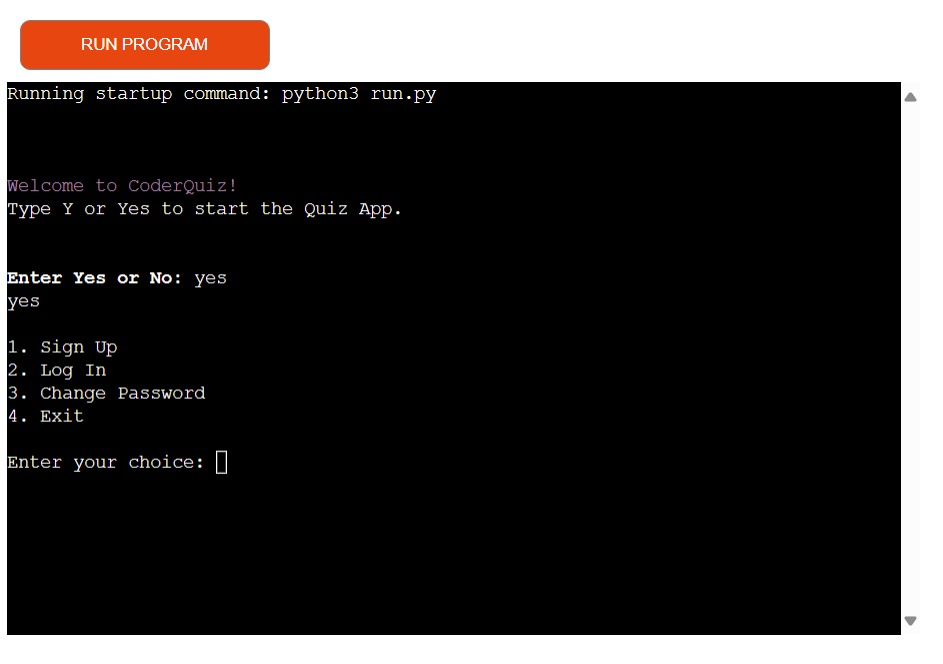
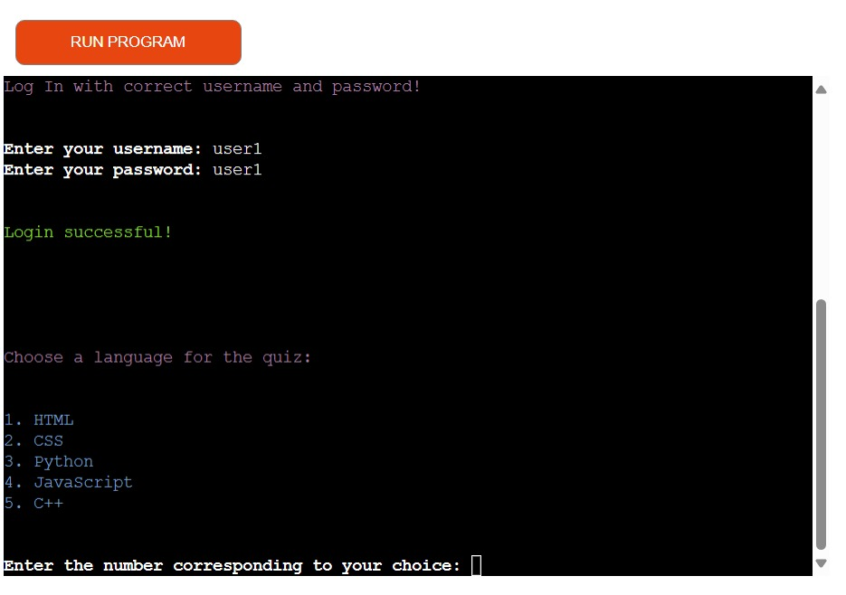
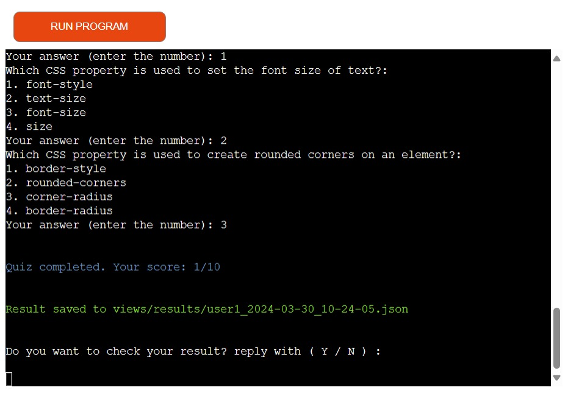
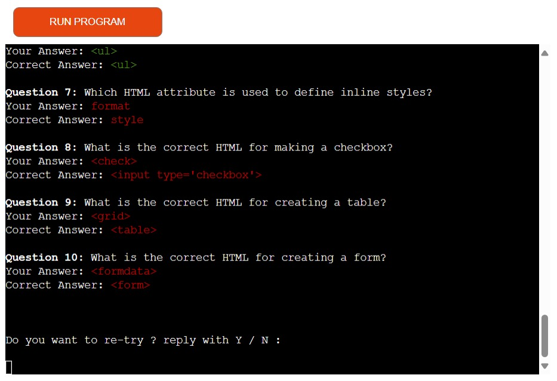

# Python Quiz Game 

- This python Game is consist on Quiz. 
- Its also a good way to learn information about some programimng languages.
- Game is very simple and informativ.

[Here is the live Quiz Game.](https://python-quiz-game-3ac9886f5af6.herokuapp.com/)

 ## How to play
 
- Firstly players need to sign up and after that they can continue the game.
- Players can select language and then continue the quiz in selected language. 
- At the end players can see the result. Players can also re-try the game. 
- players select the option by pressing the numbers.  

## Features
### Existing Features

- Firstly we enter yes to start the game, and then select the option 

    
Sign Up Area screenshot

    

- User can login or sign up by selecting the 2 number.

    
After Sign Up Area screenshot

    

- After sign in user can select the language and start the game.

    
Enter Password screenshot

    

- At the end of the quiz user can see the score.

    
score screenshot

    

- If user want to know about the right answers the press Y

    
result screenshot

    

- If user want to re try the game press Y

    
Re-try screenshot

    

